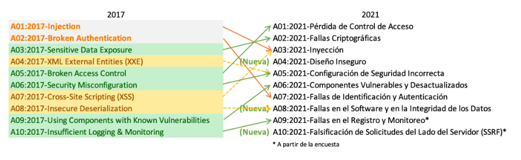

LA SEGURIDAD DEBE SER ADECUADA, ni más ni menos

REGLAS
    - El riesgo cero no es práctico, no existe
    - Existen diversos modos de mitigar riesgos
    - No se puede gastar $1M, en proteger $1

SEG. EN APPS WEB
    - Seg en Cliente
      - Código móvil

    - Seg en Seridor
      - Web Server, Database Server, Language Server

    - Seg en la APP
      - Control de Acceso
      - Validacion de Datos
      - Programacion segura

    - Seg en la Comunicacion
      - Certificados Digitales, SSL

ASPECTOS DE PHP QUE DAN LUGAR A VULNERABILIDADES
    - Variables globales (desactivado ya desde PHP 8)
    - Nombres de ficheros
    - subida de ficheros
    - Bibliotecas
    - Datos enviados desde formularios

En PHP.ini

    -importante tener --> allow_url_fopen = off; --> así no permitimos abrir ficheros que no sean de mi servidor

CHECKEO DE FICHEROS
    - realpath(); convierte relative dir, en absolute dir
    - basename(); toma una ruta y devuelve el nombre y extension del fichero
    - htmlspecialchars($comentario) es para que no nos injecten codigo html en un form
    - 
INJECTIONS SQL
    - en un login se pueden saltar el password si en el nombre nos meten juan'--
    - 'OR'1'='1 --> sacaria el listado de todo 

VERIFICAR ENVIO DE ARCHIVO

  - if (isset($_FILES[$file_field]) && isset($_FILES[$file_field]['error']== UPLOAD_ERR_OK)

        UPLOAD_ERR_OK, verifica que no hay error